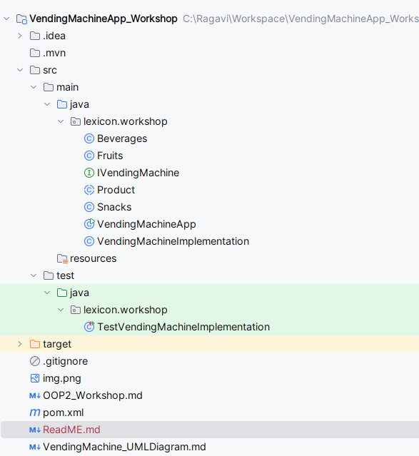
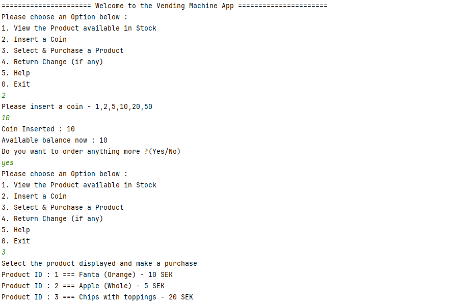

This is a console-based Java application that simulates a vending machine using Object-Oriented Programming (OOP) principles.

The system allows users to:

* View available products
* Insert coins
* Purchase products
* Get remaining balance (change)

**Project Structure**

**Output**

